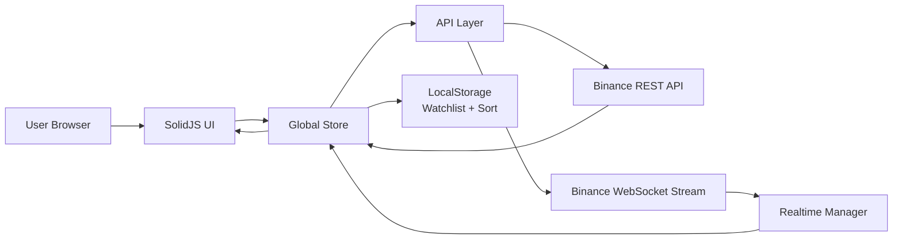

# Chromy

Chromy is a real-time cryptocurrency dashboard built with SolidJS, Vite, and Binance market data.

## System Architecture (Real-Time Flow)



### Real-Time Lifecycle

1. App loads top market data from Binance REST.
2. Realtime manager subscribes to active symbols over WebSocket.
3. Incoming ticker updates are buffered and flushed to state.
4. UI re-renders with live prices, change, volume, and sparkline updates.
5. Watchlist and user sort preferences persist in local storage.

## Product Overview

Born in the noise of nonstop crypto markets, Chromy started as a simple idea: make real-time market intelligence feel clear, fast, and human. Chromy turns chaotic price movement into a clean command center for builders, traders, and curious newcomers.

## Core Features

- Live ticker updates for top USDT pairs
- Dashboard with market cards, gainers, and losers
- Coin detail page with chart ranges (`24H`, `7D`, `30D`, `90D`, `1Y`)
- Live order book and recent trades
- Search, sort, and watchlist-only mode
- Keyboard shortcuts: `/`, `W`, `R`, `Esc`
- ZAR display formatting (`R`) for prices and market values

## Tech Stack

| Layer | Technology |
|---|---|
| Frontend Framework | SolidJS |
| Language | TypeScript |
| Build Tool | Vite |
| Styling | Tailwind CSS v4 |
| Market Data | Binance REST + WebSocket |
| Persistence | Browser LocalStorage |
| Deployment | Vercel |

## Visual Stack Icons

<p>
  
</p>

<p>
  
  
  
  
  
  
</p>

## Project Structure

```text
src/
  api.ts
  store.tsx
  types.ts
  utils.ts
  index.tsx
  index.css
  components/
    CoinList.tsx
    ErrorBoundary.tsx
    Header.tsx
    OrderBook.tsx
    PriceChart.tsx
    RecentTrades.tsx
    Sparkline.tsx
    ui.tsx
  pages/
    Dashboard.tsx
    CoinDetail.tsx
    NotFound.tsx
public/
  favicon.svg
assets/
  binance.svg
```

## Getting Started

### Prerequisites

- Node.js 18+
- npm

### Install

```bash
npm install
```

### Run Development Server

```bash
npm run dev
```

Default local URL:
`http://127.0.0.1:5173`

### Build and Preview

```bash
npm run build
npm run preview
```

## NPM Scripts

- `npm run dev` - start local development server
- `npm run build` - create production build
- `npm run preview` - preview production build locally

## Data Sources

Public Binance endpoints (no API key required):

- `GET /api/v3/ticker/24hr`
- `GET /api/v3/klines`
- `GET /api/v3/depth`
- `GET /api/v3/trades`
- `wss://stream.binance.com:9443/ws`

## Deployment

Chromy is configured for Vercel static deployment.

- Main branch deploys automatically
- SPA routing fallback is configured in `vercel.json`

## Contributors

https://github.com/MbuyeloMich/Chromy/graphs/contributors
